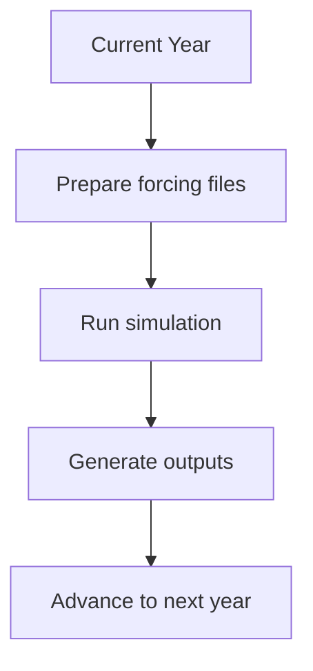

# 🚀 Job Submission Workflow

This document describes how to configure and submit NEMO3.6 simulations on the HPC system using PBS job scheduling.
---

# 📂 Script Location

Example:

```text
CONFIG/ORCA1_PISCES_FLX/SCRIPTS/
```

---

# 📜 Job Script

Example script:

```text
job_SSP585-fS_MMM-cMMM-v1_1958-1967
```

This script controls:
- experiment configuration
- runtime preparation
- forcing setup
- restart handling
- HPC job submission
- model execution

---

# ⚙️ Overall Workflow


---

# 🧩 PBS Job Configuration

The script uses PBS for HPC job scheduling.

## Example

```bash
#PBS -N SSP585
#PBS -q normal
#PBS -l select=2:ncpus=32:mem=120GB
#PBS -l walltime=12:00:00
```

---

# 📌 PBS Parameters

| Parameter | Description |
|---|---|
| `#PBS -N` | Job name |
| `#PBS -q` | Queue selection |
| `#PBS -l select` | Node and CPU allocation |
| `mem` | Memory allocation |
| `walltime` | Maximum runtime |

---

> [!IMPORTANT]
> Resource allocation should be consistent with the NEMO domain decomposition settings.

---

# ⚙️ Experiment Configuration

The following variables define the experiment setup.

| Variable | Description |
|---|---|
| `starting_year` | First simulation year |
| `ending_year` | Final simulation year |
| `job_starting_year` | First year for current job segment |
| `job_ending_year` | Final year for current job segment |
| `MODEL` | Atmospheric forcing model |
| `SCENAR` | SSP scenario |
| `vers` | Experiment version |

---

# 🌊 Forcing Configuration

The experiment forcing is controlled using anomaly switches.

| Variable | Meaning |
|---|---|
| `lfano` | Enable forcing anomalies |
| `lQano` | Heat flux anomaly |
| `lSano` | Salinity anomaly |
| `lFano` | Freshwater flux anomaly |

---

> [!NOTE]
> These switches determine which forcing perturbations are activated during the simulation.

---

# 🏷️ Experiment Naming Convention

Example:

```text
SSP585-fS_MMM-cMMM-v1
```

---

## Naming Structure

| Component | Meaning |
|---|---|
| `SSP585` | Climate scenario |
| `fS` | Salinity anomaly forcing |
| `MMM` | Forcing model |
| `cMMM` | Coefficient dataset |
| `v1` | Experiment version |

---

# 📂 Runtime Directories

The script defines several runtime paths.

| Variable | Purpose |
|---|---|
| `HOMEDIR` | Main working directory |
| `CFGDIR` | Configuration directory |
| `EXEDIR` | Executable directory |
| `R_INPUTS` | Runtime input files |
| `R_OUTPUTS` | Runtime output files |

---

# 🧱 HPC Module Environment

The script loads required software modules before execution.

Typical modules include:
- NETCDF
- NCO
- CDO
- MPI libraries

---

# 🔄 Simulation Loop

The simulation is typically executed year by year.

Example workflow:



---

# 📦 Runtime File Preparation

Before launching the simulation, the script:
- copies namelist files
- stages forcing files
- prepares restart files
- copies XML output definitions
- links executable files

---

# ▶️ Launching NEMO

The compiled executable:

```text
nemo.exe
```

is launched through MPI execution.

Typical launch methods:
- `mpirun`
- `mpiexec`
- `aprun`

depending on the HPC system.

---

# 🔄 Restart Simulations

Restart simulations require:
- restart files
- restart flags in the namelist
- consistent timestep settings

---

> [!WARNING]
> Restart timestep inconsistencies may cause simulation crashes.

---

# 📤 Model Outputs

Output frequency is controlled through XML configuration files.

Examples:
- monthly outputs
- yearly outputs
- tracer diagnostics

Related files:

```text
PARAM/XML/
```

---

# ⚠️ Common Issues

| Problem | Possible Cause |
|---|---|
| Job fails immediately | Incorrect module environment |
| MPI crash | MPI task mismatch |
| No outputs generated | XML configuration issue |
| Simulation stops early | Insufficient walltime |
| Missing restart files | Incorrect restart path |

---

# ✅ Best Practices

✅ Modify:
- experiment years
- forcing switches
- walltime
- output frequency

❌ Avoid modifying:
- executable structure
- original NEMO source code
- MPI launcher configuration

---

# 📚 Related Documentation

- `directory_structure.md`
- `workflow.md`
- `namelist.md`
- `xml_output.md`
- `troubleshooting.md`
